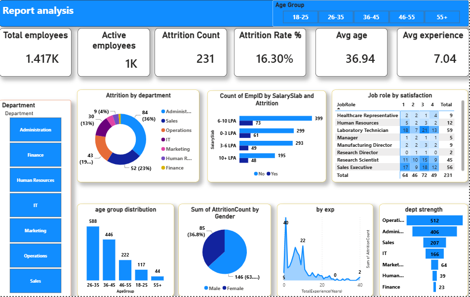

# End-to-End HR Analytics Dashboard & Data Model

##  Project Overview
This project transforms raw, unstructured HR data into an interactive, enterprise-grade Business Intelligence solution. It is designed to help executive leadership and HR partners track workforce metrics, identify high-risk attrition trends, and make data-driven talent retention decisions.

##  Tech Stack & Tools
* **Data Source:** Excel (`HR_Analytics-4.xlsx`)
* **BI & Modeling Platform:** Power BI Desktop
* **Languages:** DAX (Data Analysis Expressions) for complex calculations, Power Query (M) for ETL
* **Methodology:** Star Schema Data Modeling

##  Data Engineering & ETL Pipeline
Before building the visuals, a robust data foundation was established using Power Query:
1. **Data Cleaning:** Handled missing values, corrected inconsistent data types, and removed duplicate records from the raw dataset.
2. **Schema Standardization:** Restructured the flat file into an optimized schema separating dimension tables from fact data where applicable.
3. **Conditional Columns:** Created custom columns for conditional logic (e.g., categorizing tenure brackets or age groups) to streamline dashboard filtering.

##  Data Modeling & DAX Measures
Instead of relying on basic Excel aggregates, this solution implements advanced DAX measures to dynamic metrics. Key calculations include:
* **Attrition Rate %:** Dynamically calculates workforce turnover relative to total headcount.
* **Active Employee Count:** Filters and tracks real-time current staff levels across departments.
* [Add 1 more specific DAX measure or KPI you calculated here]

The data model utilizes a clean structure to minimize memory footprint and optimize dashboard rendering speed over large datasets.

##  Key Business Insights
* **Attrition Hotspots:** Identified specific departments and tenure ranges experiencing the highest turnover rates.
* **Demographic Trends:** Uncovered correlations between employee demographics (age, distance from office) and retention levels.
* **Actionable Takeaways:** Provided HR leadership with a clear view of where to allocate recruitment and employee engagement budgets.

##  How to Run the Project
1. Clone this repository to your local machine.
2. Ensure you have **Power BI Desktop** installed.
3. Open the file located in `pbix/hr-pb.pbix`.
4. If prompted to refresh data, point the data source path to the `data/HR_Analytics-4.xlsx` file in your local directory.
